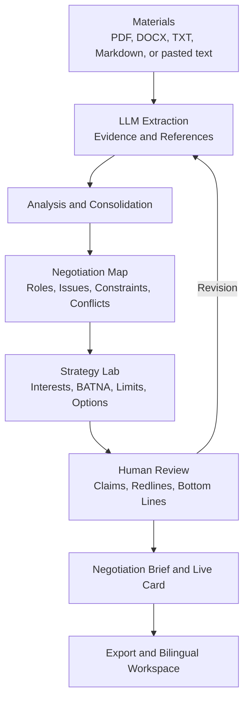
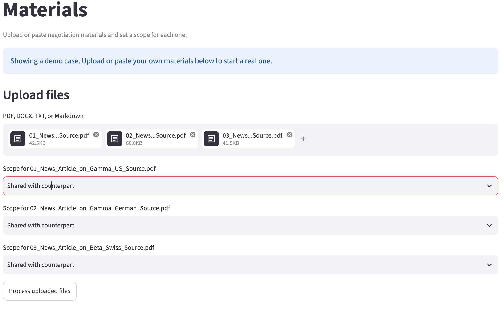
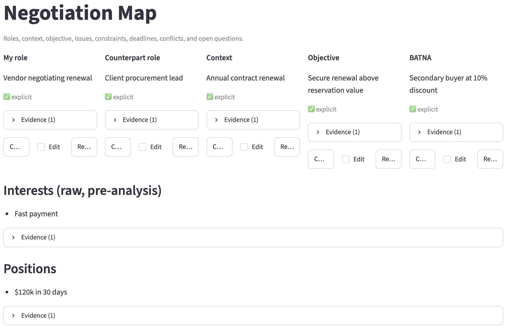
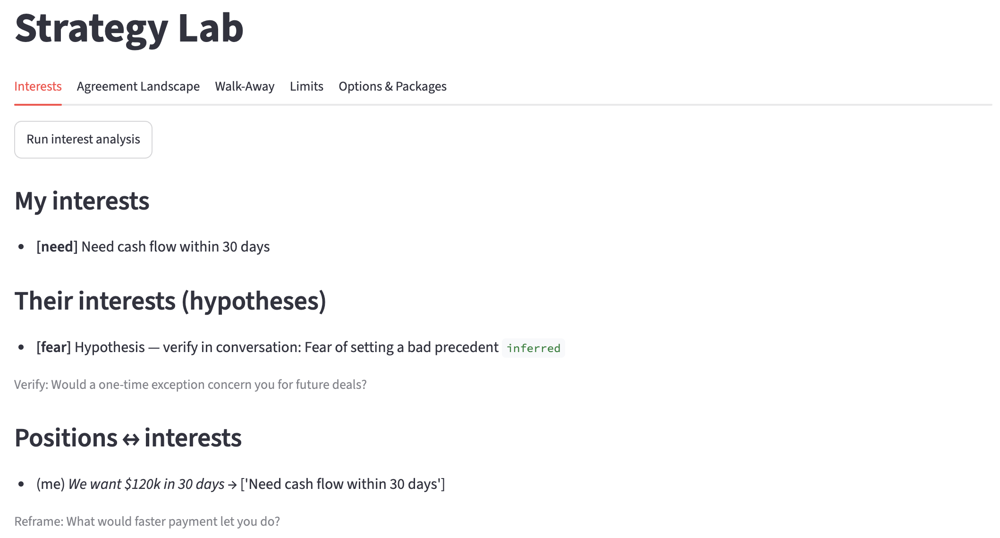
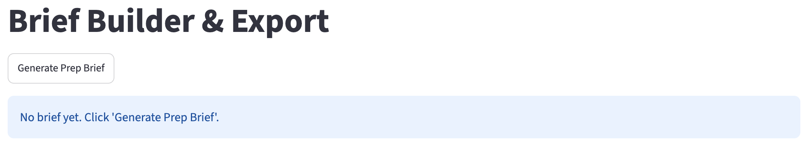
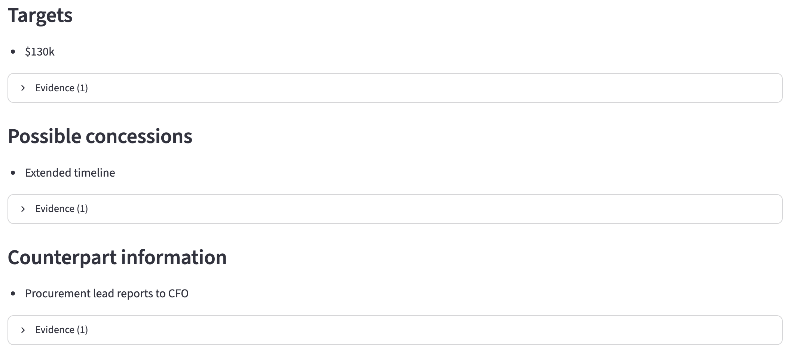

# Negotiation Copilot: Workflow and Interface Report

**Author:** Jingjun Xu
**Date:** 2026/09/09
**Link:** https://github.com/JingjunXu/negotiation_tool

## Project Overview

Negotiation Copilot is a local web application designed to address three practical challenges in negotiation preparation and execution: (1) relevant facts and constraints are dispersed across multiple documents; (2) negotiators may lose track of their redlines and walk-away conditions during live discussions; and (3) generating creative, interest-based options under time pressure is difficult. To address these challenges, the application combines multi-format ingestion with **LLM-assisted extraction** to organize source materials and **summarize supporting evidence**. It then applies **interest analysis and option generation** to help users identify priorities, formulate potential trades and packages, and refine their redlines and bottom lines. These outputs are presented through a **human-in-the-loop Streamlit interface** that enables users to verify evidence, revise model-generated content, confirm critical limits, and retain control over strategic decisions.

## Workflow

The workflow converts source materials into a reviewable case, strategic analysis, and live negotiation support.

**Design rationale and supported use.**
The workflow mirrors negotiation preparation: evidence is organized, structured into a case, analyzed strategically, and distilled into a live brief. A multi-page Streamlit interface provides progressive disclosure while linking sources, computations, and outputs. It supports multi-document review, redline tracking, and interest-based option generation while retaining final judgment with the user.

**Implementation note.** Automated tests primarily use offline or simulated clients; browser-level testing with live LLM API calls remains limited. Current API-integration issues have prevented complete validation of all interface interactions, so some API-dependent functions are not yet fully implemented or stable.

<table>
  <tr>
    <td></td>
    <td></td>
  </tr>
  <tr>
    <td></td>
    <td></td>
  </tr>
</table>

<!-- 

 -->

## Future Adaptation

Future work should evaluate whether the web interface operates reliably under valid API calls. It should also streamline information presentation to reduce cognitive overload and improve interpretability. Further development could focus on a live, stage-sensitive interface that provides context-dependent strategic recommendations throughout different phases of the negotiation.
